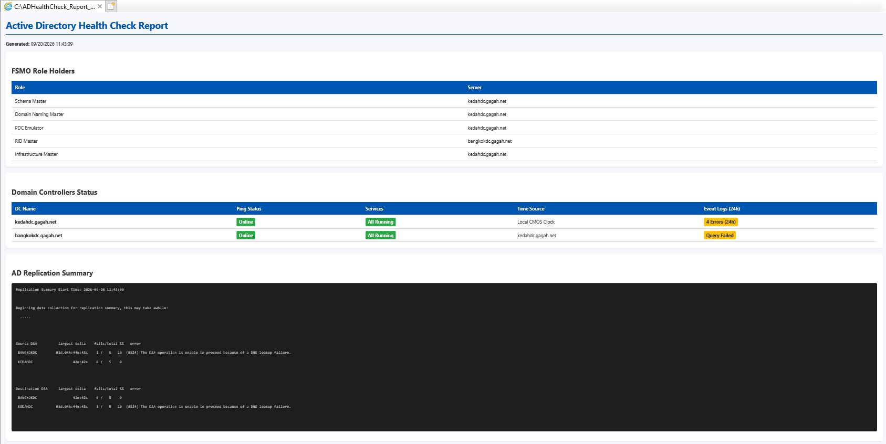

# Active Directory Domain Controller Health Check


A lightweight PowerShell diagnostic tool designed to evaluate the operational health of Active Directory Domain Controllers (DCs). It automates key administrative checks for services, replication, SYSVOL status, diagnostics, and FSMO role allocations.

---

## 🔍 Included Health Checks

| Check | Tool / Command | Description |
| :--- | :--- | :--- |
| **Core DC Services** | `Get-Service` | Verifies service status and start types for `NTDS`, `DNS`, `KDC`, `Netlogon`, and `W32Time`. |
| **AD Replication** | `repadmin` | Runs `/showrepl` and `/replsummary` to check partner status and replication failures. |
| **SYSVOL Sync** | `dfsrmig` | Queries global DFSR state (`/getglobalstate`) for SYSVOL replication health. |
| **DC Diagnostics** | `dcdiag` | Performs comprehensive, verbose diagnostics (`/v`) across core DC roles and DNS configs. |
| **FSMO Roles** | `netdom` | Identifies current holders of all 5 Operations Master roles. |

---

## 🚀 Getting Started

### Prerequisites

* **OS:** Windows Server (2012 R2 or newer)
* **Privileges:** Run with elevated **Domain Admin** or equivalent credentials.
* **Tools:** Active Directory Domain Services (AD DS) tools / RSAT installed.

### Installation & Execution

Run the script directly from GitHub without cloning the repo:

```powershell
iwr -useb https://raw.githubusercontent.com/raznulasri/Domain-Controller-AD-Health-Check/main/DCHealthCheck.ps1 | iex
```
Or download script to your local Windows machine (desktop)

```powershell
cd $home\Desktop
Invoke-WebRequest -Uri "https://raw.githubusercontent.com/raznulasri/Domain-Controller-AD-Health-Check/main/DCHealthCheck.ps1" -OutFile ".\DCHealthCheck.ps1"
```
Active Directory Health Check Script (HTML Output). Log file will save to C:\

```powershell
iwr -useb https://raw.githubusercontent.com/raznulasri/Domain-Controller-AD-Health-Check/main/browserhc.ps1 | iex
```


### Manual list of command

* Get-Service -Name NTDS, DNS, KDC, Netlogon, W32Time | Select-Object Name, DisplayName, Status, StartType
* repadmin /showrepl
* repadmin /replsummary
* dfsrmig /getglobalstate
* dcdiag /v
* netdom query fsmo

#### Optional

* repadmin /syncall /AeD
